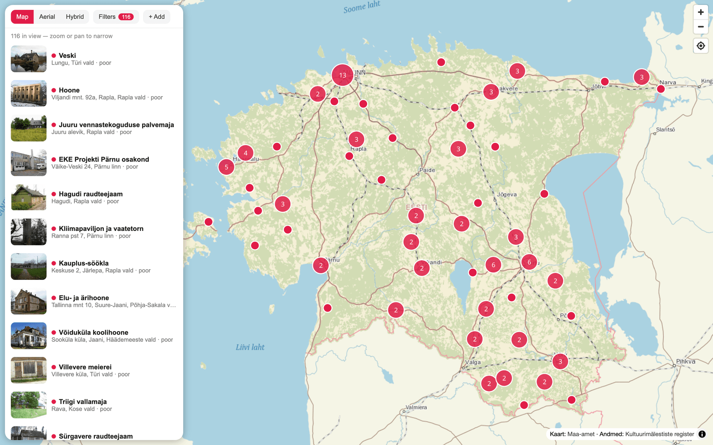
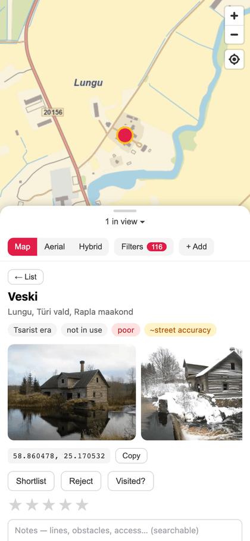

# Bando Map

**Live at [bando.lagle.xyz](https://bando.lagle.xyz)** — every push to `main` deploys automatically.

A full-screen map of abandoned buildings ("bandos") in Estonia — potential FPV drone flying spots.

Data comes from the Estonian heritage register's [XX century architecture catalog](https://register.muinas.ee/public.php?menuID=architecture), filtered to buildings that are **not in use** (kasutus: ei kasutata) and in **poor condition** (seisukord: halb). Each spot links back to the register, Google Maps, and Maa-amet's [XGIS](https://xgis.maaamet.ee/xgis2/page/app/maainfo).

<p align="center">
  
  
</p>

The base map is Maa-amet's own tile service — the same detailed base map, orthophoto, and hybrid layers as the official maainfo app.

## Quick start

```sh
npm install
npm run dev        # app on http://localhost:5173
```

The scraped dataset and thumbnails are **not in git** (the register's content isn't ours to redistribute) — they live only in S3 and the scraper reproduces them. For a working dev setup, pull the live dataset:

```sh
mkdir -p public/data
curl -so public/data/bandos.json https://bando.lagle.xyz/data/bandos.json
```

Photos will 404 locally without `public/thumbs/` — run the scraper (below) or sync them from the bucket (`aws s3 sync s3://bando.lagle.xyz/thumbs public/thumbs`, needs credentials) if you want them.

## Refreshing the data

```sh
npm run scrape        # first run ~30–40 min with default polite delays; reruns are cached
npm run publish-data  # sync public/data + public/thumbs to S3, invalidate /data/*
```

The pipeline (`scripts/scrape/`):

1. Scrapes the **full catalog** (~1,950 records): one unfiltered search plus one search per usage/condition value to attribute those fields (the register's list view doesn't show them; searches POST to a PHP session, pagination reuses the cookie). Row counts are validated against the register's own "Kokku: N" totals.
2. Marks **candidates** — records that are unused (*ei kasutata*) or in poor condition (*halb*).
3. Geocodes candidates with Maa-amet's free [In-ADS gazetteer](https://inaadress.maaamet.ee/) — no API key. Register addresses predate the administrative reforms, so queries retry with settlement-type words stripped (e.g. *Ilmatsalu alevik* is now a *küla* — the stale type word makes In-ADS return nothing). Every point carries a `geocode` precision flag (`building` / `street` / `village`), since some register addresses are only village-level.
4. Applies manual corrections from `data/overrides.json` — coordinates from the app's Move tool (`geocode: "manual"`) and register-field edits from the Edit tool; wins over everything. Cross-referencing the official monument register was tried and dropped: the two catalogs name buildings too differently for reliable matching.
5. Downloads one photo per candidate and stores a 480px webp in `public/thumbs/` (local thumbnails keep the map fast and are a step toward full offline use).
6. Writes `public/data/bandos.json` (geocoded candidates, used by the app) and `data/catalog.json` (everything). Both are gitignored — `npm run publish-data` ships them to S3, which is their only home.

Everything is disk-cached under `data/cache/` (gitignored) — delete it for a fresh run. `SCRAPE_DELAY_MS` (default 3000) and `IMAGE_DELAY_MS` (default 1500) tune request pacing. Be considerate — it's a small public heritage service.

## Architecture

- **Vite + React + TypeScript**, [MapLibre GL JS](https://maplibre.org/) for the map (WebGL, built-in clustering, smooth on mobile).
- Map tiles: Maa-amet public TMS (`kaart@GMC`, `foto@GMC`, `hybriid@GMC` — EPSG:3857, TMS y-axis).
- All user state lives in the browser's localStorage, exportable/importable as JSON. No analytics script, no tracker, no cookie — the only usage figures are aggregate daily counts derived from CloudFront's own access logs (see [Visit stats](#visit-stats)).
- **Workflow**: triage spots online — *Shortlist* the promising ones, *Reject* the duds (hidden by default, recoverable via filters) — then mark them *Visited* in the field and rate 1–5 stars with notes. Marker colors: red = new, blue = shortlisted, green = visited, gray = rejected.
- **Custom places**: add your own spots (name + notes, no photos) straight onto the map; they live in localStorage and ride along in exports.
- **Corrections**: the *Move* tool repositions a wrong pin (with undo), the *Edit* tool corrects register fields (name, address, era, usage, condition). Corrections are stored as their own keys in the export. (*Copy fixes* in the filter panel still emits them as `data/overrides.json` content — the manual escape hatch.)
- **Community sourcing**: the *Contribute* tab collects your shareable changes — moved pins, field edits, added places (never personal state like shortlists or notes) — and submits each as its own reviewable item, with live status: pending with age, approved, or rejected *always with a reason*. Approving in the *Admin* tab (admin accounts only: review queue with old→new diffs drawn on the map, usage stats, registered users, daily visits by country) republishes `data/community.json`, which every client merges over the dataset on load — corrections go live for everyone in seconds, no rescrape. The UX borrows deliberately: iD's unsaved-count badge, OSMCha's map-diff review, and one-item-per-submission + mandatory rejection reasons to avoid Google Maps' opaque-moderation trap.
- **Deep links**: selecting a spot puts `#b/<id>@<lat>,<lon>` in the URL — share it, and if the receiver doesn't have that spot, the map zooms to the coordinates instead.
- **Offline (PWA)**: installable; everything browsed (app, dataset, photos, map tiles) is cached automatically and keeps working without signal. The Offline panel is transparent about storage — real byte counts per category, clearable — and lets you save the current map view down to street level, or all spot photos, before heading somewhere remote. Maa-amet serves CORS-clean tiles, so cached sizes are honest (no opaque-response padding).
- **Cross-device sync (optional)**: sign in from the Offline panel and your marks, notes, custom places and corrections follow you to every device. Merging is per-mark by `updatedAt` (the same logic as JSON import), so devices don't clobber each other. Signed-out use is unaffected — localStorage remains the source of truth.
- `src/types.ts` is the single schema shared by the app and the scraper.

## Roadmap

Work is tracked on the public [Bando Map project board](https://github.com/users/lightheaded/projects/2);
every card there is a [repository issue](https://github.com/lightheaded/bando-map/issues), so the
history is readable without the board.

- [x] **Phase 0 — POC**: scrape the ~116 unused/poor-condition buildings, geocode, show clustered on the map with photos and detail panel
- [x] **Phase 1 — Full data pipeline**: all catalog records with usage/condition attribution, local thumbnails, manual coordinate overrides
- [x] **Phase 2 — User state**: triage workflow (shortlist / reject online, then visit, rate and take notes in the field), multi-select filters, note-aware search, JSON export/import, custom places, shareable deep links
- [x] **Phase 3 — Polish & offline**: photo markers for unclustered spots, installable PWA with full offline support (app shell, dataset, photos, and saved map areas cached locally with a transparent storage panel)
- [x] **Phase 4 — Accounts & auto-grading**: [cross-device sync behind Cognito SSO](https://github.com/lightheaded/bando-map/issues/12), and [auto-graded attributes](https://github.com/lightheaded/bando-map/issues/17) answering "remote or urban?" — every ruin footprint carries its area and its distance to the nearest lived-in house, both computed at scrape time. [Periodic scraping](https://github.com/lightheaded/bando-map/issues/21) is the one idea left over and continues as its own issue.

## Sync backend

`infra/backend.tf` + `backend/handler.mjs`: Cognito user pool (Lite, hosted UI, email+password — Google federation can be added later) → API Gateway HTTP API with a JWT authorizer (unauthenticated requests never reach compute) → a single Lambda (arm64, Node 22, no build step) → DynamoDB on-demand at `api.bando.lagle.xyz`. One sync document per user, plus community submissions in the same table (`pk=sub#<uuid>`; listing scans — at this scale that beats a GSI). Routes: `GET|PUT /sync`, `GET|POST /submissions`, and `GET /admin/overview` + `POST /admin/submissions/{id}` gated on membership of the `admin` Cognito group (see [Granting admin](#granting-admin)). Approvals rebuild `data/community.json` from all approved submissions and publish it to the site bucket + invalidate CloudFront. Deploys via `terraform -chdir=infra apply` (the handler zip is content-hashed). The SPA config (API URL, Cognito domain, client id — all public identifiers) lives in `src/sync/config.ts`.

Everything scales to zero — cost details live in the [Cost](#cost) section below.

### Granting admin

Admin rights come from membership of the `admin` Cognito group, never from a
list in this repo — no personal email address belongs in version control or in
the shipped bundle. The Lambda checks the token's `cognito:groups` claim on
every `/admin/*` route; the frontend reads the same claim to show the Admin tab.

```sh
POOL=$(terraform -chdir=infra output -raw cognito_user_pool_id)
aws cognito-idp admin-add-user-to-group \
  --user-pool-id "$POOL" --group-name admin --username '<email>'   # your own address, not committed
```

Group changes take effect on the user's next token refresh (sign out and back
in for an immediate switch). List current admins with
`aws cognito-idp list-users-in-group --user-pool-id "$POOL" --group-name admin`.

## Visit stats

`infra/stats.tf` + `backend/rollup.mjs`: CloudFront standard logging (v2) delivers a trimmed
8-field access log (including `c-country` and `cs(User-Agent)`, no referrer, cookies or query
strings) to a private, date-partitioned bucket. A scheduled Lambda re-reads the last
`stats_rollup_days` days and writes one `stat#YYYY-MM-DD` item to the sync table; the Admin
panel's **Visits** card reads it from `GET /admin/overview`. Every run is a full recompute of its
window, so a missed run heals itself and nothing tracks processed objects.

Read the numbers with three caveats:

- **Page loads, not sessions.** Only `/` and `/index.html` count as a view. Unknown paths also
  return the app shell (the SPA 403 fallback), but counting those would turn every
  `/wp-login.php` probe into a visit, so they land in `other` instead.
- **Repeat visits undercount.** The service worker serves returning visitors from cache, and
  those loads never reach CloudFront.
- **The human/bot split is a user-agent guess.** It is shown alongside, never subtracted — the
  per-day country breakdown is what makes a spike judgeable. `visitors` counts distinct viewer
  IPs among human page views; the rollup stores only that count, never an address.

The raw log archive is kept indefinitely, so a question asked later can still be answered against
the original records — day-partitioned prefixes mean the rollup only ever lists the days it is
recomputing, so its cost doesn't grow with the archive. Those records do contain viewer IPs (the
daily aggregates never do): set `stats_log_retention_days` to have S3 expire them after N days, or
drop `c-ip` from `record_fields` to stop logging them at all (at the price of the `visitors`
metric, which needs them to tell one person's ten page loads from ten people's).

Delivery lags a request by minutes to about an hour, and changes to the logging *configuration*
take up to 12 hours to take effect. Force a rebuild of a longer window at any time with:

```sh
aws lambda invoke --function-name bando-map-stats-rollup \
  --cli-binary-format raw-in-base64-out --payload '{"days":7}' /dev/stdout
```

## Cost

Every resource is tagged (`Project=bando-map`, `Component=site|sync|stats` — see `infra/main.tf`),
so Cost Explorer can split hosting from the backend once the cost-allocation tags are activated.
**Both tables below are living documents** (see AGENTS.md): any infra or usage-pattern change
updates the projections; the Actual column is filled from Cost Explorer after each month closes.

Projected monthly cost per component, at idle and at ~5 daily active users (~3k API requests):

| Component | Idle | 5 DAU | Notes |
|---|---|---|---|
| API Gateway (HTTP API) | $0 | ~$0.004 | $1.06/M requests in eu-north-1 — sync, submissions and admin calls |
| Lambda (arm64, 256 MB) | $0 | $0 | inside the permanent free tier (1M req + 400k GB-s) |
| DynamoDB (on-demand) | $0 | ~$0.07 | sync writes dominate (~25 KB doc = 25 WRU at $0.67/M); submission items, one stats item per day and admin scans are noise; storage ≪ 25 GB free |
| Cognito (Lite) | $0 | $0 | free to 10,000 MAU; ListUsers API calls are free |
| S3 (site + data + pdfs, ~1 GB) | ~$0.02 | ~$0.02 | storage; deploy PUTs and community.json publishes are fractions of a cent |
| CloudFront | $0 | $0 | permanent free tier: 1 TB egress + 10M requests/month |
| CloudFront invalidations | $0 | $0 | 1,000 free paths/month; one per deploy + one per submission approval |
| CloudWatch logs (14 d retention) | $0 | <$0.01 | |
| Access-log delivery (stats) | $0 | $0 | standard logging v2 to S3 carries no CloudFront or CloudWatch charge |
| S3 access-log storage (stats) | $0 | <$0.01 | a trimmed 8-field record ≈ 200 B raw, gzipped on delivery — roughly 5–10 MB/month at this traffic. Kept forever by default, so this grows: ~$0.003/mo after a year, ~$0.01/mo after three. Set `stats_log_retention_days` to cap it |
| S3 GETs from the rollup (stats) | $0 | ~$0.02 | **the one stats line that scales with traffic**: every run re-reads its whole window, so cost ≈ log objects/day × `stats_rollup_days` × runs/day × $0.004/10k. At ~200 objects/day, 2 days, 4 runs/day ≈ 48k GETs/month |
| Rollup Lambda + schedule (stats) | $0 | $0 | 4 invocations/day inside the free tier; EventBridge scheduled rules are free |
| **Total** | **≈ $0.02** | **≈ $0.12** | ~$1.80 even at 100 DAU |

Excluded: the Route53 hosted zone ($0.50/mo) — `lagle.xyz` is a pre-existing personal zone shared
with other projects.

Running record — add a row when a month starts, fill Actual from Cost Explorer
(filter `Project=bando-map`) after it closes, never rewrite past rows:

| Month | Projected | Actual | Notes |
|---|---|---|---|
| 2026-08 | ~$0.04 | | sync launched + community review shipped mid-month, visit stats late in the month; a few users at most |
| 2026-09 | ~$0.12 | | first full month with accounts + submissions + visit stats, assuming ~5 DAU |

## Deployment

The app is a static site served from S3 behind CloudFront at **https://bando.lagle.xyz**.

- `infra/` holds the Terraform/OpenTofu stack: private S3 origin (OAC), CloudFront with SPA fallback, ACM certificate, Route53 records, and a GitHub-OIDC deploy role — no long-lived AWS keys anywhere. Apply locally: `cd infra && terraform apply` (uses ambient AWS credentials, or pass `-var aws_profile=...`). State is local and gitignored.
- `.github/workflows/deploy.yml` builds and syncs `dist/` to S3 on every push to `main` (hashed assets get immutable caching; the HTML shell revalidates), then invalidates CloudFront. It authenticates by assuming the OIDC role from repo variables `AWS_DEPLOY_ROLE_ARN`, `S3_BUCKET`, `CLOUDFRONT_DISTRIBUTION_ID`. The dataset, thumbnails and PDF archive under `/data/`, `/thumbs/` and `/pdfs/` are published out-of-band (`npm run publish-data`) and deploys never touch them.

## Versioning & releases

Releases are semver git tags (`v0.x.y`, minor = feature release, patch = fix) with a
human-readable history in [CHANGELOG.md](CHANGELOG.md). The version in `package.json` is
the single source of truth; Vite injects it at build time and the app shows it behind the
map's attribution ⓘ icon, linked to the changelog. Versions up to v0.13.0 were tagged
retroactively from git history with backdated tag dates.

To cut a release, in the same commit that ships the feature to `main`: move its
`[Unreleased]` changelog entries under a new version heading, bump `version` in
`package.json` to match, then:

```sh
git tag -a v0.14.0 -m "One-line summary"   # matches the new package.json version
git push --follow-tags
```

Pushing the tag auto-creates a [GitHub Release](https://github.com/lightheaded/bando-map/releases)
with that version's changelog section as notes (`.github/workflows/release.yml`).

## Attribution & license

- Building data: [Kultuurimälestiste register](https://register.muinas.ee/) (Muinsuskaitseamet), reused under Estonia's public information act
- Base map, orthophoto, geocoding: [Maa-amet](https://geoportaal.maaamet.ee/)
- Hint layers (optional map overlays, `npm run scrape-hints`):
  - ETAK ruins: [Eesti topograafia andmekogu](https://geoportaal.maaruum.ee/) (Maa- ja Ruumiamet), open-data license, attribution required
  - OSM ruins: © [OpenStreetMap](https://www.openstreetmap.org/copyright) contributors, ODbL — kept as its own dataset (collective database), never merged record-by-record with other sources
  - Military heritage: [Eesti sõjaajaloo teejuht](https://teejuht.esap.ee/) (Eesti Sõjamuuseum / ESAP), used in good faith with attribution — spots link and preview their own [ESAP database](https://db.esap.ee/) record; the photos stay hot-linked from db.esap.ee, never copied into this project
  - Officially ownerless buildings: [Ametlikud Teadaanded](https://www.ametlikudteadaanded.ee/) (peremehetu ehitise hõivamise teated) — spots keep the announcing municipality's contact and link the original notice; last-known-owner names are not redistributed

The source code is [MIT-licensed](LICENSE). Register data and photos are not part of this repository and remain with their respective owners.

Fly responsibly: heritage-listed buildings are protected — look, film, don't touch. Check local drone regulations (https://transpordiamet.ee/droonid) before flying.
