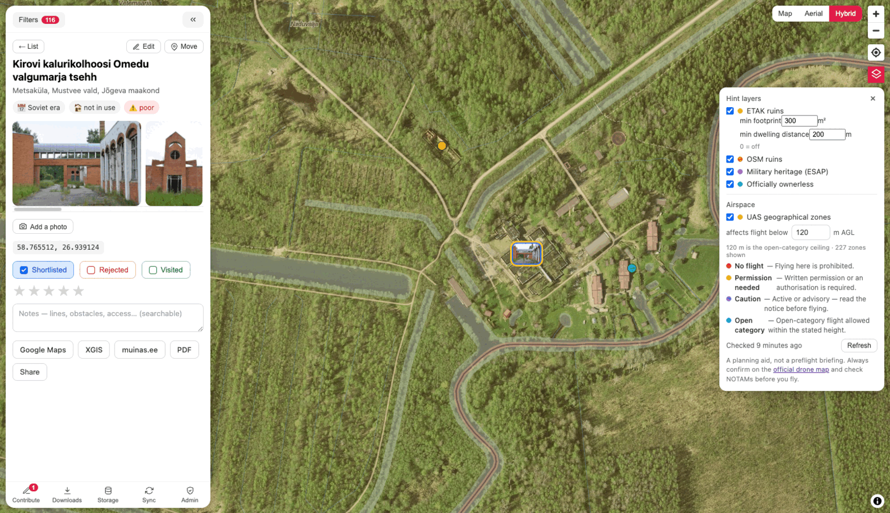
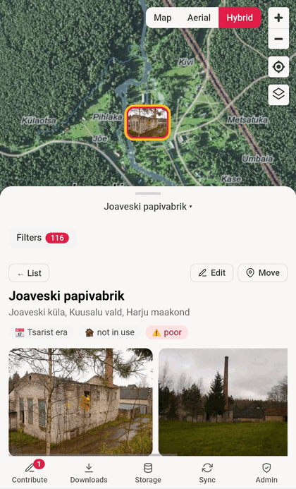

# Bando Map

**Live at [bando.toom.as](https://bando.toom.as)** — every push to `main` deploys automatically.

A full-screen map of abandoned buildings ("bandos") in Estonia — potential FPV drone flying spots.

Data comes from the Estonian heritage register's [XX century architecture catalog](https://register.muinas.ee/public.php?menuID=architecture), filtered to buildings that are **not in use** (kasutus: ei kasutata) and in **poor condition** (seisukord: halb). Each spot links back to the register, Google Maps, and Maa-amet's [XGIS](https://xgis.maaamet.ee/xgis2/page/app/maainfo).

<p align="center">
  
  
</p>
<p align="center">
  
  
</p>

The base map is Maa-amet's own tile service — the same detailed base map, orthophoto, and hybrid layers as the official maainfo app.

## Features

- **Every candidate on one map** — 324 spots distilled from ~1,950 register records, all but one with photos, each carrying address, era, usage and condition and linking back to the register, Google Maps and Maa-amet XGIS.
- **Triage, then fly** — shortlist the promising ones and reject the duds from the sofa; mark them visited, rate 1–5 and take notes in the field. Marker colour carries the state: red new, blue shortlisted, green visited, grey rejected.
- **Filters that match how you search** — usage, condition, county, triage status and minimum rating, plus a text search that looks inside your own notes. Rejected spots stay hidden until you ask for them.
- **Hint layers** — four supplementary sources for leads the register doesn't list: 36,323 ETAK ruin footprints, 3,760 OSM ruins, 3,025 military-heritage sites and 698 officially ownerless buildings, each linking and previewing its own source record.
- **Remoteness grading** — every ETAK footprint carries its area and its distance to the nearest lived-in house, so the 36k can be cut down to big buildings well clear of occupied yards before you drive anywhere. Both cuts are on by default.
- **Airspace before you drive** — Estonia's official UAS drone zones, drawn under the spots by default and coloured by how much they actually restrict flying. Each zone carries its vertical band, so the layer answers "how high can I legally go here" instead of "am I in a zone" (a countrywide 150–2900 m band covers every spot on the map). The Layers menu on the map holds the height cut, the legend, the copy's age and a Refresh — refreshed hourly regardless, going red past 6 hours, with https://utm.eans.ee/avm/ and NOTAMs staying the authority before a flight.
- **Your own places** — add spots the register never had, with names and notes; they ride along in exports.
- **Corrections** — drag a misplaced pin to where the building actually is (with undo), or fix the register fields themselves.
- **Community sourcing** — submit those corrections for review; once approved they reach every visitor within seconds, no rescrape. Rejections always come with a reason. An admin is the reviewer, so their own contributions publish on submission.
- **Contributed photos** — add your own photo of a place, in the New place form as you create it or from any place's detail panel: the register's pictures are often decades old, and a spot the community added has none at all. The browser downscales and re-encodes before uploading, which is also what removes the original's EXIF — the GPS tag where it was taken included. Every photo waits for review, and only your own work is accepted. A photo of yours can be taken back at any point, published or still waiting.
- **Cross-device sync (optional)** — sign in and your marks, notes, places and corrections follow you everywhere. Signed-out use is untouched: localStorage stays the source of truth.
- **Offline-first** — installable, and everything you have browsed keeps working without signal. Save the current map view down to street level, or every spot photo, before heading somewhere remote.
- **Deep links** — every spot has a shareable URL; if the receiver's dataset lacks that spot, the map flies to the coordinates instead.
- **No tracking** — no analytics script and no cookie. Usage figures are aggregate daily counts derived from the CDN's own access logs (see [Visit stats](#visit-stats)). One third party sits in the bundle: Sentry, which receives a report when the app breaks and nothing at any other time — no identity, no page-by-page trail (see [Error reporting](#error-reporting)).

## Quick start

```sh
npm install
npm run dev        # app on http://localhost:5173
```

The scraped dataset and thumbnails are **not in git** (the register's content isn't ours to redistribute) — they live only in S3 and the scraper reproduces them. For a working dev setup, pull the live dataset:

```sh
mkdir -p public/data
curl -so public/data/bandos.json https://bando.toom.as/data/bandos.json
```

Photos will 404 locally without `public/thumbs/` — run the scraper (below) or sync them from the bucket (`aws s3 sync s3://bando-map-site/thumbs public/thumbs`, needs credentials) if you want them.

## Refreshing the data

```sh
npm run scrape        # first run ~30–40 min with default polite delays; reruns are cached
npm run publish-data  # sync public/data + public/thumbs to S3, invalidate /data/*
```

The pipeline (`scripts/scrape/`):

1. Scrapes the **full catalog** (~1,950 records): one unfiltered search plus one search per usage/condition value to attribute those fields (the register's list view doesn't show them; searches POST to a PHP session, pagination reuses the cookie). Row counts are validated against the register's own "Kokku: N" totals.
2. Marks **candidates** — records that are unused (*ei kasutata*) or in poor condition (*halb*).
3. Geocodes candidates with Maa-amet's free [In-ADS gazetteer](https://inaadress.maaamet.ee/) — no API key. Register addresses predate the administrative reforms, so queries retry with settlement-type words stripped (e.g. *Ilmatsalu alevik* is now a *küla* — the stale type word makes In-ADS return nothing). Every point carries a `geocode` precision flag (`building` / `street` / `village`), since some register addresses are only village-level.
4. Applies manual corrections from `data/overrides.json` — coordinates from the app's Move tool (`geocode: "manual"`) and register-field edits from the Edit tool; wins over everything. Cross-referencing the official monument register was tried and dropped: the two catalogs name buildings too differently for reliable matching.
5. Downloads one photo per candidate and stores a 480px webp in `public/thumbs/` (local thumbnails keep the map fast and are a step toward full offline use).
6. Writes `public/data/bandos.json` (geocoded candidates, used by the app) and `data/catalog.json` (everything). Both are gitignored — `npm run publish-data` ships them to S3, which is their only home.

Two files under `data/` are not part of this pipeline: `community.json` (written by the sync
Lambda when a submission is approved) and `zones.json` (written by the airspace fetcher, see
[Airspace zones](#airspace-zones)). `npm run publish-data` excludes both, so publishing a scrape
can never overwrite a fresher Lambda-written copy with a stale local one.

Everything is disk-cached under `data/cache/` (gitignored) — delete it for a fresh run. `SCRAPE_DELAY_MS` (default 3000) and `IMAGE_DELAY_MS` (default 1500) tune request pacing. Be considerate — it's a small public heritage service.

## Architecture

- **Vite + React + TypeScript**, [MapLibre GL JS](https://maplibre.org/) for the map (WebGL, built-in clustering, smooth on mobile).
- Map tiles: Maa-amet public TMS (`kaart@GMC`, `foto@GMC`, `hybriid@GMC` — EPSG:3857, TMS y-axis).
- All user state lives in the browser's localStorage, exportable/importable as JSON. No analytics script, no tracker, no cookie — the only usage figures are aggregate daily counts derived from CloudFront's own access logs (see [Visit stats](#visit-stats)).
- **Workflow**: triage spots online — *Shortlist* the promising ones, *Reject* the duds (hidden by default, recoverable via filters) — then mark them *Visited* in the field and rate 1–5 stars with notes. Marker colors: red = new, blue = shortlisted, green = visited, gray = rejected.
- **Custom places**: add your own spots (name + notes, no photos) straight onto the map; they live in localStorage and ride along in exports.
- **Corrections**: the *Move* tool repositions a wrong pin (with undo), the *Edit* tool corrects register fields (name, address, era, usage, condition). Corrections are stored as their own keys in the export. (*Copy fixes* in the filter panel still emits them as `data/overrides.json` content — the manual escape hatch.)
- **Community sourcing**: the *Contribute* tab collects your shareable changes — moved pins, field edits, added places, and proposed deletions of places that are gone or never belonged (never personal state like shortlists or notes) — and submits each as its own reviewable item, with live status: pending with age, approved, or rejected *always with a reason*. Nothing in that card has left the device yet, so every row can also be dropped from it: the place goes, the correction reverts, the queued deletion is withdrawn — Undo in the toast. Below it, *Your submissions* lists what has already gone: each row opens its place on the map, and a photo row can be deleted from there. Approving in the *Admin* tab (admin accounts only: review queue with old→new diffs drawn on the map, usage stats, registered users, daily visits by country) republishes `data/community.json`, which every client merges over the dataset on load — corrections go live for everyone in seconds, no rescrape. The UX borrows deliberately: iD's unsaved-count badge, OSMCha's map-diff review, and one-item-per-submission + mandatory rejection reasons to avoid Google Maps' opaque-moderation trap.
- **Airspace (UAS zones)**: Estonia's official drone-restriction zones as their own layer, coloured by how much a zone actually restricts flight. Each entry keeps its vertical band and its message — the message is where a nominally unrestricted nature zone admits it needs a written permit, so colour alone would misrepresent it. The copy comes from `data/zones.json`, refreshed hourly by a Lambda rather than fetched from the browser (see [Airspace zones](#airspace-zones)); the app shows how fresh it is and links the official map, which stays the authority before a flight.
- **Deep links**: selecting a spot puts `#b/<id>@<lat>,<lon>` in the URL — share it, and if the receiver doesn't have that spot, the map zooms to the coordinates instead.
- **Offline (PWA)**: installable; everything browsed (app, dataset, photos, map tiles) is cached automatically and keeps working without signal. The Offline panel is transparent about storage — real byte counts per category, clearable — and lets you save the current map view down to street level, or all spot photos, before heading somewhere remote. Maa-amet serves CORS-clean tiles, so cached sizes are honest (no opaque-response padding).
- **Cross-device sync (optional)**: sign in from the Offline panel and your marks, notes, custom places and corrections follow you to every device. Merging is per-mark by `updatedAt` (the same logic as JSON import), so devices don't clobber each other. Signed-out use is unaffected — localStorage remains the source of truth.
- `src/types.ts` is the single schema shared by the app and the scraper.

## Roadmap

Work is tracked on the public [Bando Map project board](https://github.com/users/lightheaded/projects/2);
every card there is a [repository issue](https://github.com/lightheaded/bando-map/issues), so the
history is readable without the board.

- [x] **Phase 0 — POC**: scrape the ~116 unused/poor-condition buildings, geocode, show clustered on the map with photos and detail panel
- [x] **Phase 1 — Full data pipeline**: all catalog records with usage/condition attribution, local thumbnails, manual coordinate overrides
- [x] **Phase 2 — User state**: triage workflow (shortlist / reject online, then visit, rate and take notes in the field), multi-select filters, note-aware search, JSON export/import, custom places, shareable deep links
- [x] **Phase 3 — Polish & offline**: photo markers for unclustered spots, installable PWA with full offline support (app shell, dataset, photos, and saved map areas cached locally with a transparent storage panel)
- [x] **Phase 4 — Accounts & auto-grading**: [cross-device sync behind Cognito SSO](https://github.com/lightheaded/bando-map/issues/12), and [auto-graded attributes](https://github.com/lightheaded/bando-map/issues/17) answering "remote or urban?" — every ruin footprint carries its area and its distance to the nearest lived-in house, both computed at scrape time. [Periodic scraping](https://github.com/lightheaded/bando-map/issues/21) is the one idea left over and continues as its own issue.

## Sync backend

`infra/backend.tf` + `backend/handler.mjs`: Cognito user pool (Lite, hosted UI, email+password — Google federation can be added later) → API Gateway HTTP API with a JWT authorizer (unauthenticated requests never reach compute) → a single Lambda (arm64, Node 22, no build step) → DynamoDB on-demand at `api.bando.toom.as`. One sync document per user, plus community submissions in the same table (`pk=sub#<uuid>`; listing scans — at this scale that beats a GSI). Routes: `GET|PUT /sync`, `GET|POST /submissions`, `POST /photos` + `GET|DELETE /photos/{id}`, and `GET /admin/overview` + `POST /admin/submissions/{id}` gated on membership of the `admin` Cognito group (see [Granting admin](#granting-admin)). Approvals rebuild `data/community.json` from all approved submissions and publish it to the site bucket + invalidate CloudFront; an approved deletion adds its id to that file's `deleted` list, which every client filters the dataset against. A submission whose author is in the `admin` group is approved as it arrives and rebuilds the file in the same request — the queue exists to hold work back until a reviewer trusts it, and an admin already is that reviewer. Deploys via `terraform -chdir=infra apply` (the handler zip is content-hashed). The SPA config (API URL, Cognito domain, client id — all public identifiers) lives in `src/sync/config.ts`.

Everything scales to zero — cost details live in the [Cost](#cost) section below.

### Contributed photos

The upload path is deliberately lopsided: the browser does the image work, the
backend does none. `src/photos/prepare.ts` decodes the chosen file, downscales it
to a 1600 px view copy and a 480 px thumbnail and re-encodes both as webp (JPEG
where a browser can't encode webp). Three things follow from that. The original's
metadata is gone, because a canvas carries none — no EXIF parser to trust and no
GPS coordinates to leak. A 6 MB phone photo becomes ~200 KB before it leaves the
device. And no image decoder ever runs in our account, so there is no
libvips-shaped attack surface to keep patched: `POST /photos` reads the container
header for the format and dimensions (`imageSize` in `backend/handler.mjs`,
refusing anything it can't parse) and then only moves bytes.

Uploads land in a private review bucket under `pending/<submission id>/`. It has
no CloudFront origin, so nothing unreviewed is reachable from the site; the
reviewer sees the image through `GET /photos/{id}`, which serves it from that
bucket to the contributor and to admins and to nobody else. Approval copies both
renders into the site bucket under `data/photos/` (immutable caching — a
published photo never changes under its name) and lists the token in
`data/community.json` under `photos`. Withdrawing an approval deletes them
again. The review copy stays as the record of what was uploaded until its
180-day lifecycle rule expires it.

A contributor can take their own photo back at any point, published or still
waiting, from the trash button on the picture in a place's detail panel or on
the row in Contribute → Your submissions. An admin can take back anybody's.
`DELETE /photos/{id}` removes the published renders, the review copy and the
submission record, and rebuilds `data/community.json` without it. There is no
undo, so the button arms first and a second press confirms. The record is
removed rather than marked, because there is no decision to keep: a rejection is
a reviewer's verdict that the queue must remember, and this is the contributor
changing their mind about their own picture.

Per contributor: 20 photos a day, 30 waiting for review at once. The limits are
not about cost — storage and processing here round to zero (see
[Cost](#cost)) — but about the one resource that doesn't scale, which is the
time it takes to look at each one. Neither limit applies to an admin, whose
uploads are published without a reviewer. Only own work is accepted, declared
per upload; the register's photos are not ours to redistribute and neither is
anyone else's.

### Granting admin

Admin rights come from membership of the `admin` Cognito group, never from a
list in this repo — no personal email address belongs in version control or in
the shipped bundle. The Lambda checks the token's `cognito:groups` claim on
every `/admin/*` route; the frontend reads the same claim to show the Admin tab.

```sh
POOL=$(terraform -chdir=infra output -raw cognito_user_pool_id)
aws cognito-idp admin-add-user-to-group \
  --user-pool-id "$POOL" --group-name admin --username '<email>'   # your own address, not committed
```

Group changes take effect on the user's next token refresh (sign out and back
in for an immediate switch). List current admins with
`aws cognito-idp list-users-in-group --user-pool-id "$POOL" --group-name admin`.

## Visit stats

`infra/stats.tf` + `backend/rollup.mjs`: CloudFront standard logging (v2) delivers a trimmed
8-field access log (including `c-country` and `cs(User-Agent)`, no referrer, cookies or query
strings) to a private, date-partitioned bucket. A scheduled Lambda re-reads the last
`stats_rollup_days` days and writes one `stat#YYYY-MM-DD` item to the sync table; the Admin
panel's **Visits** card reads it from `GET /admin/overview`. Every run is a full recompute of its
window, so a missed run heals itself and nothing tracks processed objects.

Read the numbers with three caveats:

- **Page loads, not sessions.** Only `/` and `/index.html` count as a view. Unknown paths also
  return the app shell (the SPA 403 fallback), but counting those would turn every
  `/wp-login.php` probe into a visit, so they land in `other` instead.
- **Repeat visits undercount.** The service worker serves returning visitors from cache, and
  those loads never reach CloudFront.
- **The human/bot split is a user-agent guess.** It is shown alongside, never subtracted — the
  per-day country breakdown is what makes a spike judgeable. `visitors` counts distinct viewer
  IPs among human page views; the rollup stores only that count, never an address.

The raw log archive is kept for seven years (`stats_log_retention_days`, 2557 days), so a question
asked later can still be answered against the original records — day-partitioned prefixes mean the
rollup only ever lists the days it is recomputing, so its cost doesn't grow with the archive. Those
records contain viewer IPs and the expiry is what bounds how long they are held; the daily
aggregates never contain one and have no expiry, so the visit history outlives the logs it was
derived from. Set the variable to `null` to keep the raw logs forever, or drop `c-ip` from
`record_fields` to stop logging addresses at all — at the price of the `visitors` metric, which
needs them to tell one person's ten page loads from ten people's.

Delivery lags a request by minutes to about an hour, and changes to the logging *configuration*
take up to 12 hours to take effect. Force a rebuild of a longer window at any time with:

```sh
aws lambda invoke --function-name bando-map-stats-rollup \
  --cli-binary-format raw-in-base64-out --payload '{"days":7}' /dev/stdout
```

## Airspace zones

`backend/zones.mjs` (Terraform in `infra/zones.tf`): Estonia's **UAS geographical zones** — the
drone-restriction airspace behind the national drone map at https://utm.eans.ee/avm/ — drawn from
our own copy at `data/zones.json`, refreshed hourly by a scheduled Lambda.

The source is public and unauthenticated, so fetching it straight from the browser looks like the
obvious choice. It isn't:

- It is **uncompressed** — 5.1 MB on the wire under any `Accept-Encoding` — and served
  `Cache-Control: private, max-age=1`, so neither the CDN nor the browser cache ever helps. Its
  `bounds` parameter barely helps either: a box with only 15 zones in it still returns 2.1 MB,
  because a few enormous national rings are in every response.
- Every visitor's IP would go to EANS, which breaks the no-third-party promise the rest of the app
  keeps.
- The layer would be blank offline.

So the Lambda pays the 5.1 MB once an hour, trims it to **1.11 MB (about 289 kB gzipped over
CloudFront)** and publishes it to the site bucket. The trim drops
`properties.geometry.horizontalProjection` — a byte-for-byte duplicate of each feature's own
geometry, roughly half the payload — and rounds coordinates to 6 decimals (~11 cm, far past what an
airspace boundary means). The fetcher writes the source's own fields through; what counts as
restrictive is decided in the app, not in the Lambda.

Every zone carries its vertical band, so the layer answers "how high can I legally go here" rather
than "is this inside a zone" — the latter is useless, because a countrywide 150–2900 m band covers
literally every spot on the map. The app always shows how old its copy is and links
https://utm.eans.ee/avm/ as the authority: **this is a triage aid, never an authoritative preflight
source** — check the official map and NOTAMs before flying.

**Overlapping zones.** Airspace stacks: a spot near an airfield can sit inside a control zone, a
nature zone and an active danger area at once, each binding independently. A click therefore reports
the whole stack in one popup — every zone under the cursor, most restrictive first, with its own
verbatim message — rather than only the polygon drawn on top, which hid rules the reader is equally
bound by.

**Manual refresh.** `POST /zones/refresh` reruns the fetch on demand, throttled to 3 per client per
day and 10 globally per hour. Both counters are DynamoDB items claimed with a conditional update
(so two simultaneous refreshes can't both slip past a limit) and expire via TTL. The per-client one
is keyed by a salted HMAC of the request IP, so nothing that can be turned back into an address is
ever written down — the same stance as [Visit stats](#visit-stats). It is the first route in the
project with no authorizer in front of it; the cost consequence is spelled out in [Cost](#cost).

**Ownership.** `data/zones.json` is written by this Lambda, like `data/community.json` —
`npm run publish-data` excludes both, so a local publish never overwrites a fresher copy. The file
is rewritten on every run so its `checkedAt` stays honest about when we last looked, but CloudFront
is only invalidated when the zones themselves changed. Deploys via `terraform -chdir=infra apply`,
NOT via the site workflow.

## Error reporting

Both halves report their own faults to [Sentry](https://sentry.io), in the EU region and in two
separate projects: `bando-map` for the browser, `bando-map-api` for the three Lambda functions.
They stay apart on purpose — a render crash and a server fault share nothing but a release name,
and one stream that mixes them groups neither well.

Before this the project told nobody it had broken. A crash inside a component left a blank page,
and a refused API call left a toast that only the person in front of the screen ever saw. A photo
upload failed on 26 August 2026 and left nothing behind that named the cause.

### The browser

Three things reach the `bando-map` project:

- An error that nothing catches. React 19 hands these to the root error hooks in `src/main.tsx`.
- A render error caught by the boundary around the app. The app then shows
  [`src/components/CrashScreen.tsx`](src/components/CrashScreen.tsx) in place of a blank page,
  with a reload button and the id of the report.
- A refused API call, with its route, its status and the sentence the API answered with.
  `reportApiRefusal` in [`src/obs/sentry.ts`](src/obs/sentry.ts) collapses the ids out of the
  path, so every refusal of the same route groups into one issue instead of one issue per id.

#### What never reaches the browser project

- **Nothing from development.** `Sentry.init` runs with `enabled: import.meta.env.PROD`, so
  `npm run dev` reports nothing.
- **No identity.** `sendDefaultPii` is off, the signed-in email address is never attached, and
  `beforeSend` deletes the user, the headers and the cookies from every event. The project also
  has "Prevent Storing of IP Addresses" turned on. Sentry still derives a coarse region from the
  connection at the moment it accepts an event, which is city-level and is not stored as an
  address.
- **No query strings.** A login redirect lands on `/?code=…`. That code is single-use and
  short-lived, but it is a credential, so `beforeSend` drops the query from every URL it reports.
  The hash stays, because it is the public deep link to a place.
- **No request bodies.** Breadcrumbs record the method, the URL and the status of a call. Nothing
  that a call carried goes with them.
- **No failed requests from a device with no signal.** This app is built to be used without one,
  so a failed fetch is a normal event and is filtered out by message. Refused API calls are
  reported explicitly instead, which keeps the real failures visible without the noise.

#### Where the configuration lives, and why not here

**No Sentry identifier is written down in this repository.** A DSN is write-only and a project
slug is not a credential, but both name the Sentry organisation they belong to, and this repository
is public — see AGENTS.md, "whose fact is this?". Every one of them is supplied at build or apply
time instead:

| Value | Supplied by | Absent means |
|---|---|---|
| `VITE_SENTRY_DSN` | deploy workflow secret | the app reports nothing |
| `SENTRY_AUTH_TOKEN` | deploy workflow secret | no source maps, traces stay minified |
| `SENTRY_ORG`, `SENTRY_PROJECT` | deploy workflow secrets, read by the plugin itself | no source maps |
| `sentry_dsn` (the API) | `infra/terraform.tfvars`, gitignored | the Lambdas report nothing |

So a clone of this repository builds and runs with error reporting off, and that is the intended
behaviour rather than a gap. Nothing has to be edited out before sharing it.

#### Source maps and releases

The SDK reports the version from `package.json` as the release, so an issue names the build it
came from. `SENTRY_AUTH_TOKEN` in the environment turns on `@sentry/vite-plugin` in
`vite.config.ts`: the build emits hidden source maps, uploads them to the matching release and
deletes them again. No map is published: the plugin removes them, workbox is told not to write its
own, and `--exclude "*.map"` in the S3 sync is the last line of defence.

One thing to know about that upload: if the token is present but rejected, the plugin logs the
failure and the build still exits 0. The deploy then succeeds with no source maps, and the next
issue arrives minified with no other warning. If traces suddenly stop naming real files, read the
build log for `[sentry-vite-plugin] Error` before looking anywhere else.

The SDK adds ~31 KB gzipped to the app bundle. It is precached with the rest of the shell, so it
costs one download, not one per visit.

### The API

[`backend/sentry.mjs`](backend/sentry.mjs) is the whole of it: about eighty lines, one POST, no
dependency. `reporting()` wraps each of the three handlers, so anything a handler throws is sent
before the error leaves, and re-thrown untouched — the runtime still fails the invocation and
CloudWatch still holds the full trace.

An event carries the exception with real file names, line numbers and the five lines of source
either side, the release, and the Lambda request id with a link straight to the log stream that
holds the rest. Nothing needs a source map: the deployed file **is** the source file, so the
reporter reads the surrounding lines back off disk.

**Sentry's own SDK layer was tried here first and rejected on measurements**, which is worth
knowing before anybody proposes it again:

| | Cold start | Resident memory |
|---|---|---|
| Before either | ~0.5 s | ~126 MB |
| Sentry SDK layer | ~1.8 s | ~199 MB |
| `backend/sentry.mjs` | ~0.5 s | ~130 MB |

Three cold runs each, on `bando-map-sync`. The memory number is what killed it: a photo upload had
already peaked at 199 MB decoding base64, and another 70 MB on top clears the function's 256 MB, at
which point Lambda kills the invocation. Reporting a fault is not worth causing one.

What the layer gave and this does not: breadcrumbs, automatic capture of anything a handler does
not await, and a warning as a timeout approaches. CloudWatch holds the console output already,
every handler awaits everything it does, and a timeout shows in the duration metric.

One trap is written down in the file itself, because it cost an hour to find. Had the layer stayed,
the preload flag would have had to be `-r`, never `--import`: the SDK sits at
`/opt/nodejs/node_modules`, Lambda exposes that through `NODE_PATH`, and `NODE_PATH` is a CommonJS
mechanism that ESM resolution ignores.

#### What never reaches the API project

The event is built field by field in `eventBody`, and the API Gateway event is not one of the
fields. That distinction matters here: every call carries an `authorization: Bearer` header, and
the token inside it holds an email address. Nothing about the caller is sent — no request, no
headers, no user — and the project stores no IP address.

### Silence, which no SDK can report

A function that stops being invoked throws nothing. That is the real failure mode of the two
scheduled functions, and it is invisible: stale airspace data looks exactly like fresh airspace
data until a pilot reads the age.

So [`infra/observability.tf`](infra/observability.tf) adds a CloudWatch alarm to each. The airspace
fetcher must run at least once in two hours, the visit-stats rollup at least once in twelve. Both
report to an SNS topic. `Invocations` returns no data rather than zero when nothing ran, and
`treat_missing_data = "breaching"` is what turns that silence into an alarm.

Nothing reaches anybody until `alert_email` is set. Put it in `infra/terraform.tfvars`, which is
gitignored for exactly this reason — an address must never become committable — and re-apply:

```hcl
alert_email = "you@example.com"
sentry_dsn  = "https://…@…ingest.de.sentry.io/…"
```

AWS then sends one confirmation mail, and the subscription stays pending until the link in it is
clicked. The same variable turns on both cost budgets, so setting it once does all three. Until
then the alarms still change state and still show in the CloudWatch console; they just tell nobody.

That file is also where `budget_limit_usd` belongs. It is the ceiling for the whole AWS account
rather than for this project (see [Two budgets](#two-budgets-and-which-one-to-believe)), so its
value is a fact about the account and has no place in a public repository. The checked-in default
is deliberately a placeholder.

## Cost

Every resource is tagged (`Project=bando-map`, `Component=site|sync|stats|zones|photos` — see `infra/main.tf`),
so Cost Explorer can split hosting from the backend once the cost-allocation tags are activated.
**Both tables below are living documents** (see AGENTS.md): any infra or usage-pattern change
updates the projections; the Actual column is filled from Cost Explorer after each month closes.

Projected monthly cost per component, at idle and at ~5 daily active users (~3k API requests):

| Component | Idle | 5 DAU | Notes |
|---|---|---|---|
| API Gateway (HTTP API) | $0 | ~$0.004 | $1.06/M requests in eu-north-1 — sync, submissions and admin calls |
| Lambda (arm64, 256 MB) | $0 | $0 | inside the permanent free tier (1M req + 400k GB-s). Error reporting adds one POST on the error path and about 4 MB resident, so the sizes are unchanged |
| DynamoDB (on-demand) | $0 | ~$0.07 | sync writes dominate (~25 KB doc = 25 WRU at $0.67/M); submission items, one stats item per day and admin scans are noise; storage ≪ 25 GB free |
| Cognito (Lite) | $0 | $0 | free to 10,000 MAU; ListUsers API calls are free |
| S3 (site + data + pdfs, ~1 GB) | ~$0.02 | ~$0.02 | storage; deploy PUTs and community.json publishes are fractions of a cent |
| CloudFront | $0 | $0 | permanent free tier: 1 TB egress + 10M requests/month. The app re-checks `sw.js` whenever it comes back into use (throttled to one a minute, see [Reaching an app that is already open](#reaching-an-app-that-is-already-open)) — a few hundred conditional GETs a month at 5 DAU, nearly all answered 304 |
| CloudFront invalidations | $0 | $0 | 1,000 free paths/month; one per deploy, one per submission approval, one per deleted published photo |
| CloudWatch logs (14 d retention) | $0 | <$0.01 | |
| Access-log delivery (stats) | $0 | $0 | standard logging v2 to S3 carries no CloudFront or CloudWatch charge |
| S3 access-log storage (stats) | $0 | <$0.02 | a trimmed 8-field record ≈ 200 B raw, gzipped on delivery — roughly 5–10 MB/month at this traffic. Grows until the seven-year expiry starts biting, topping out around 0.6 GB ≈ $0.015/mo; lower `stats_log_retention_days` to cap it sooner |
| S3 GETs from the rollup (stats) | $0 | ~$0.02 | **the one stats line that scales with traffic**: every run re-reads its whole window, so cost ≈ log objects/day × `stats_rollup_days` × runs/day × $0.004/10k. At ~200 objects/day, 2 days, 4 runs/day ≈ 48k GETs/month |
| Rollup Lambda + schedule (stats) | $0 | $0 | 4 invocations/day inside the free tier; EventBridge scheduled rules are free |
| Zones fetcher Lambda (arm64, 512 MB) | $0 | $0 | ~730 runs/mo at roughly 4 s each ≈ 1,460 GB-s — inside the permanent free tier (1M req + 400k GB-s). ~$0.02/mo if that tier ever went away |
| Zones source transfer | $0 | $0 | 5.1 MB × ~730 ≈ 3.7 GB/mo pulled from EANS; AWS never charges for data in |
| S3 PUTs + storage (zones) | $0 | <$0.01 | one 1.1 MB PUT per run ≈ $0.004/mo; storage negligible |
| CloudFront invalidations (zones) | $0 | $0 | only when the zones actually change; even invalidating every run, 730 + deploys stays under the 1,000 free paths/month |
| DynamoDB (zones meta + throttle) | $0 | <$0.01 | one meta write per run plus two counter writes per manual refresh |
| API Gateway (POST /zones/refresh) | $0 | <$0.01 | capped at 10/hour globally ≈ 7,200/mo worst case at $1.06/M |
| S3 storage (contributed photos) | $0 | <$0.01 | ~210 KB per approved photo (1600 px + 480 px webp), plus a review copy that expires after 180 days. 200 photos ≈ 42 MB ≈ $0.001/mo; even 5,000 ≈ 1 GB ≈ $0.024/mo |
| Lambda + API Gateway (photo upload, preview, publish, delete) | $0 | <$0.01 | two requests per upload, one per review preview, one per deletion. No image decoding happens server-side — the browser resizes and re-encodes — so this is base64 decoding and S3 copies, far inside the free tier even at 1,000 uploads/month |
| CloudFront egress (contributed photos) | $0 | $0 | thumbnails are the same ~30 KB as the register's; a heavy 50-place session with community photos adds ~4 MB, so ~600 MB/month at 5 DAU against a **1 TB** permanent free tier. It would take ~250,000 such sessions a month to leave it |
| Sentry (Developer plan, not AWS) | $0 | $0 | 5,000 errors/month across both projects. Errors only — tracing is off in the browser (`tracesSampleRate: 0`) and the API sends nothing but exceptions, and Session Replay is not installed. At 5 DAU the project must break thousands of times a month to leave the free tier, and the plan drops events rather than billing for them |
| CloudWatch alarms | $0 | $0 | two, against a free allowance of ten |
| SNS (alarm email) | $0 | $0 | 1,000 email notifications a month are free, and a healthy month sends none |
| **Total** | **≈ $0.02** | **≈ $0.14** | ~$1.85 even at 100 DAU |

One caveat those rows don't carry: `POST /zones/refresh` is the project's first unauthenticated
route, and API Gateway bills rejected requests too — the DynamoDB counters stop the *work*, not the
request charge, so a deliberate flood is bounded only by the stage's existing 10 rps / 20 burst
throttle (~$27/month at the absolute ceiling) and `bando-map-cost-guard`.

Photo uploads are the other line worth stating a ceiling for, because they are the only route that
stores what a caller sends. They require a signed-in account and are capped per contributor (20/day,
30 pending), so the review bucket can't be turned into free storage; without those caps, a scripted
account pushing 10,000 uploads would still only cost single-digit dollars — ~$2 of transient storage
until the lifecycle rule expires it, and pennies of requests, because nothing decodes the images.
The one genuinely open-ended risk is somebody else hot-linking the *published* photos hard enough to
exhaust the 1 TB CloudFront free tier, where overage runs ~$85/TB in Europe. `bando-map-cost-guard`
would catch that long before a bill, and a Referer check is the fix if it ever happens.

Excluded: DNS. The zone that serves `bando.toom.as` is managed outside this project and costs it
nothing.

### Two budgets, and which one to believe

`bando-map-cost-guard` filters on `Project=bando-map`, which every resource here carries. It is the
only budget that answers the question this table asks, and its ceiling is `project_budget_limit_usd`
($5, against a projection well under a dollar).

`monthly-cost-guard` has no filter. It watches the whole AWS account, which holds much more than
this project, so **an alert from it is not a statement about the map**. The first time it fired,
this project's entire share of that month was about eight cents, all of it in `eu-north-1`. Keep
`budget_limit_usd` at whatever the rest of the account is expected to cost, and read that alert as
"the account moved".

A tag filter only sees costs recorded after its key was activated. `Project` and `Component` were
activated on 2026-09-01, so Cost Explorer cannot split anything before that date, and the project
budget reads low until a full month has passed.

Running record — add a row when a month starts, fill Actual from Cost Explorer
(filter `Project=bando-map`) after it closes, never rewrite past rows:

| Month | Projected | Actual | Notes |
|---|---|---|---|
| 2026-08 | ~$0.05 | | sync launched + community review shipped mid-month, visit stats and the hourly airspace fetcher late in the month; a few users at most. **Not splittable by tag** — the cost-allocation keys were only activated on 2026-09-01. The per-service figures for `eu-north-1` are the closest available reading |
| 2026-09 | ~$0.14 | | first full month with accounts + submissions + contributed photos + visit stats + hourly zones, assuming ~5 DAU; also the first full month on bando.toom.as, which adds nothing measurable |

## Deployment

The app is a static site served from S3 behind CloudFront at **https://bando.toom.as**.

The buckets are named for the project (`bando-map-site`, `bando-map-logs`), not for the address.
A bucket name is global and can never be changed, so tying one to an address means copying the whole
bucket every time the address moves. Neither is public — the site bucket is CloudFront-only via OAC —
so neither name appears in a URL.

`bando.toom.as` DNS is **not** in this repo — the zone is managed elsewhere, so terraform here cannot
publish its own ACM validation records. The sequence that puts them in place is written at the top of
[`infra/main.tf`](infra/main.tf). Read it before touching `aws_acm_certificate.site` or
`aws_acm_certificate.api`, because replacing either one makes `terraform apply` hang for up to 45
minutes waiting for a DNS record this repo cannot create.

- `infra/` holds the Terraform/OpenTofu stack: private S3 origin (OAC), CloudFront with SPA fallback, ACM certificate, Route53 records, and a GitHub-OIDC deploy role — no long-lived AWS keys anywhere. Apply locally: `cd infra && terraform apply` (uses ambient AWS credentials, or pass `-var aws_profile=...`). State is local and gitignored.
- `.github/workflows/deploy.yml` builds and syncs `dist/` to S3 on every push to `main` (hashed assets get immutable caching; the HTML shell revalidates), then invalidates CloudFront. It authenticates by assuming the OIDC role from repo variables `AWS_DEPLOY_ROLE_ARN`, `S3_BUCKET`, `CLOUDFRONT_DISTRIBUTION_ID`. The repo secret `SENTRY_AUTH_TOKEN` turns on source-map upload (see [Error reporting](#error-reporting)); the build succeeds without it. The dataset, thumbnails and PDF archive under `/data/`, `/thumbs/` and `/pdfs/` are published out-of-band (`npm run publish-data`) and deploys never touch them.

## Versioning & releases

Releases are semver git tags (`v0.x.y`, minor = feature release, patch = fix) with a
human-readable history in [CHANGELOG.md](CHANGELOG.md). The version in `package.json` is
the single source of truth; Vite injects it at build time and the app shows it behind the
map's attribution ⓘ icon, linked to the changelog. Versions up to v0.13.0 were tagged
retroactively from git history with backdated tag dates.

To cut a release, in the same commit that ships the feature to `main`: move its
`[Unreleased]` changelog entries under a new version heading, bump `version` in
`package.json` to match, then:

```sh
git tag -a v0.14.0 -m "One-line summary"   # matches the new package.json version
git push --follow-tags
```

Pushing the tag auto-creates a [GitHub Release](https://github.com/lightheaded/bando-map/releases)
with that version's changelog section as notes (`.github/workflows/release.yml`).

### Reaching an app that is already open

A deploy does not reach an installed PWA on its own. A service worker learns
that a new build exists only when something asks it to look, and an app sitting
in the background asks nothing: its timers are throttled or frozen, and a
standalone window does no navigation. The old bundle then keeps calling the new
API, and the first sign of it is a request that fails for no visible reason.

`src/sw/update.ts` asks again at every moment the app comes back into use — the
tab becoming visible, the window taking focus, the network returning — and once
more whenever a call to the API is refused, throttled to one check a minute. A
new build raises the "New version ready" banner, which comes back hourly until
it is taken. `src/main.tsx` also raises the banner on `controllerchange`: a
worker that takes over a page where one already stood means the code running is
the old build, whatever the reason the usual callback missed it.

Deploy the backend before the app. Both halves must tolerate the other being a
version behind for as long as it takes every client to reload, so add routes and
fields rather than changing what the existing ones mean.

## Attribution & license

- Building data: [Kultuurimälestiste register](https://register.muinas.ee/) (Muinsuskaitseamet), reused under Estonia's public information act
- Base map, orthophoto, geocoding: [Maa-amet](https://geoportaal.maaamet.ee/)
- Hint layers (optional map overlays, `npm run scrape-hints`):
  - ETAK ruins: [Eesti topograafia andmekogu](https://geoportaal.maaruum.ee/) (Maa- ja Ruumiamet), open-data license, attribution required
  - OSM ruins: © [OpenStreetMap](https://www.openstreetmap.org/copyright) contributors, ODbL — kept as its own dataset (collective database), never merged record-by-record with other sources
  - Military heritage: [Eesti sõjaajaloo teejuht](https://teejuht.esap.ee/) (Eesti Sõjamuuseum / ESAP), used in good faith with attribution — spots link and preview their own [ESAP database](https://db.esap.ee/) record; the photos stay hot-linked from db.esap.ee, never copied into this project
  - Officially ownerless buildings: [Ametlikud Teadaanded](https://www.ametlikudteadaanded.ee/) (peremehetu ehitise hõivamise teated) — spots keep the announcing municipality's contact and link the original notice; last-known-owner names are not redistributed
- Contributed photos: their photographers, who declare the photo their own work when they upload it and agree to it being published here. They are not part of this repository and are not offered for reuse; a photographer who uploaded one can delete it themselves from the place's detail panel, and anyone else who wants one taken down should [open an issue](https://github.com/lightheaded/bando-map/issues) so that a reviewer can remove it
- UAS geographical zones: [EANS Estonian drone map](https://utm.eans.ee/avm/) (Lennuliiklusteeninduse AS) — the official airspace feed, refetched hourly and shown with attribution and the age of our copy; advisory here, with the official map and NOTAMs remaining the authority before a flight

The source code is [MIT-licensed](LICENSE). Register data and photos are not part of this repository and remain with their respective owners.

Fly responsibly: heritage-listed buildings are protected — look, film, don't touch. Check local drone regulations (https://transpordiamet.ee/droonid) before flying.
